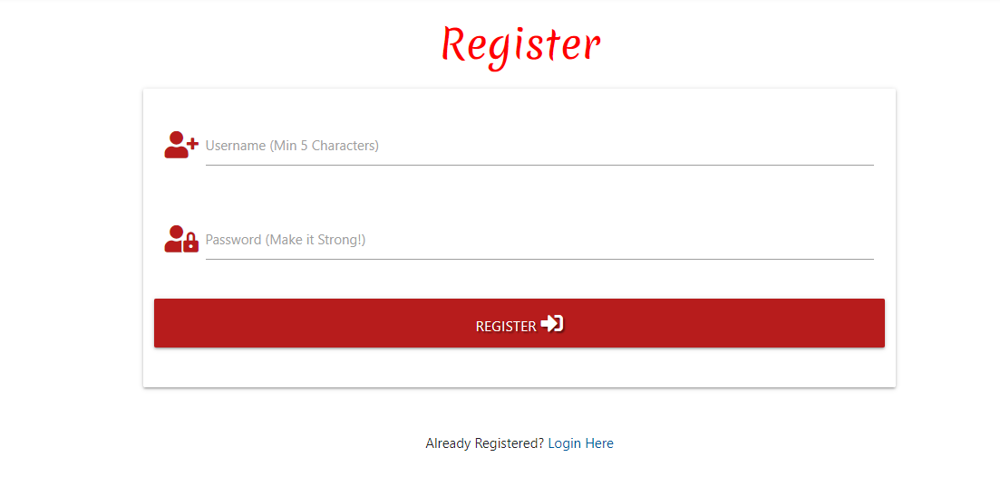
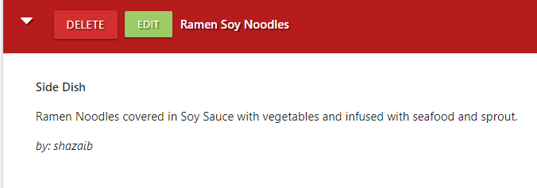
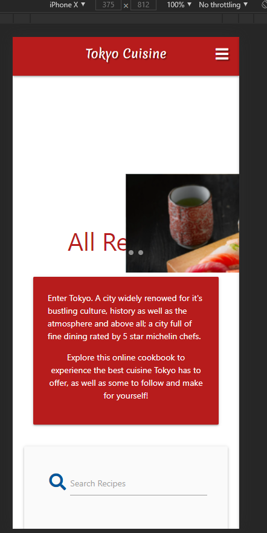

<h1 align="center">Tokyo Cuisine</h1>

<h2 align="center"></h2>

# Table of Contents 

1. [Project Introduction](#introduction)
2. [UX](#ux)
3. [Design Choices](#designchoices)
4. [Wireframes](#wireframes)
5. [Features](#features)
6. [Technologies Used](#techused)
7. [Testing](#testing)
8. [Deployment](#deployment)
9. [Credits](#credits)
10. [Acknowledgements](#acknowledgements)
11. [Disclaimer](#disclaimer)

## Project Introduction 

- ### Some Words of Mine...

This project marks my 3rd Milestone on the road to becoming a Full Stack Developer, alongside with Code Institute. Many many obstacles had prevented me
submitting this on time, as well as personal commitments and setbacks happened which had meant this project had to be put on standby as discussed with
the Student Care Team at CI. I am not satisfied with where I had wanted this project to end up being like, but given my personal circumstances, the timeframe
as well as my mental capacity, I could only do so much without the help of fellow students through Slack as well as my own personal mentor, Aaron Sinnott.

This project was done without the help of these people and was done through tough times, however I am proud of continuing this given I was battling depression, anxiety
as well as other factors that had affected my workrate through this milestone project. I am content with where it is but I myself will still continue updating this even 
though I know the outcome of the project. I am aware of what will happen but I will continue to persevere and work my hardest through this. Above all, I hope you thoroughly enjoy reading the documentation that made this website as well as the challenges I had faced.

Thank you for Reading.

- ### Project Scope

The project I have created here is a online cookbook with the theme of Japanese food. It is understood that covering the whole food of Japan would definitely take some huge 
amount of time, to counter this I have focused on 1 city in Japan, the heart of food; which is Tokyo.
The premise of this cookbook is to allow users to delve into the recipes and the great food of Japan by reading recipe additions added by users, as well as giving them the
insight as to what Japanese food consists of and how it looks like.

Japanese cuisine is widely known for its healthy ingredient usage, as well as being recognised for its cultural significance, so therefore It promotes healthy living through
the use of healthy food via their ingredients. This in turn is great as I wanted to focus my online cookbook around this, to promote healthy living and eating.

- ### Project Goal

Japanese food and in particular their cuisine has always been a passion of mine. My aim with this project was to share my love of japanese oriental cuisine with others in hopes
of them getting a glimpse of the types of food they have to offer and if given the chance by trying it too. I know there are many others out there who
enjoy oriental food and I hope to see a variety of recipes being uploaded by users to showcase to people who are passing by the website as well as active users.

To view my live project, please click on the link below. I hope you enjoy navigating through the great foods Tokyo has to offer!

[View My Live Project Here!](https://sarif-ms3-cookbook.herokuapp.com/)

# User Experience (UX) 

- ### Unregistered User Goals

    - As a unregistered user, I want to be able to see a page or a button that allows me to create an account.
    - As a unregistered user, I want to be able to notice the concept of the website easily by first glance.
    - As a unregistered user, I want to be able to access the website from a variety of devices.

- ### Registered User Goals

    - As a registered user, I want to be able to edit my own recipe's if needed to.
    - As a registered user, I want to be able to search for specific recipes within the website.
    - As a registered user, I want to be able to get a confirmation once I have added a recipe.
    - As a registered user, I want to be able to delete my recipes if needed to.
    - As a registered user, I want to be able to log in using the assigned username and password.
    - As a registered user, I want to be able to see confirmation when deleting my recipe.
    - As a registered user, I want users to see my name under recipes to know who added the recipe.

- ### Site Owner Goals

    - As an Site Owner, I want to be able to create and delete categories for the website.
    - As an Site Owner, I want to be able to do all of the above given the priveleges and permissions.
    - As an Site Owner, I want to be able to see how many registered users are there for the website.

# Design Choices 

- ### Font Selection

    - As my project was centered around Japan, and in particular Tokyo, I wanted to adapt a font that matched closer with
    the tradition, as well as closely matching it to a theme that better represented Japan as a whole.

        The font I had went with in the end was [Merienda](https://fonts.googleapis.com/css2?family=Merienda&display=swap)

    <h2 align="left"></h2>

    <h2 align="right"></h2>

    As shown above with the 2 image comparisons. There are quite close resemblances between the fonts, as they have the same characteristics. When 
    deciding the font, this was very important to me as I wanted the users to see as well as myself the close resemblance to Japan, not just in food; but
    in the theme and structure of website; so taking this into account was very important to me.

### Colour Choices

- As the center of focus for my website was a cookbook with the theme of Tokyo and Japan as a whole, my colour choice judgement
    was easy to make and narrow down to. I went with Red and White as well as their shades as this better represented the flag of Japan,
    which also contains white and Red. Using this colour combination gave me the sense of respect as I was basing the website colour theme around the flag too.

- It is very easy to add a lot of colour to a online cookbook given the wide aroma of colours used in oriental cuisine and food, but sticking with this simple
    colour combination may seem bland to others; but it fits in well with my theme as this is better represented by. Below you can find the similarities between
    the two as well as the colour palette used that will illustrate it better.

<h2 align="left"></h2>

<h2 align="right"></h2>

<h2 align="center"></h2>

## Wireframes 

- Wireframes for this project were developed and created in [Balsamiq](https://balsamiq.com).
Comparing the live version to the wireframes, there are no huge changes, as the ones I have included, include both the main design
as well as an alternate design if something was to not go my way. There are massive changes that impact the usability of the website,
but I have kept the main goal of the wireframes in mind whilst developing the website.

- Wireframes for the project can be found [here](documentation/ms3-wireframes-with-alternate-design.pdf).

## Features 

- A website with full usability to search recipes within.

- Responsive on desktop devices as well as handheld for on the go.

- A dedicated page to create and edit a recipe when needs be.

- A button to "View All" recipes when desired recipe cannot be found, making it for easy access to view all recipes with the click of a button.

### Future Features to Implement

- Profile page to be updated so it shows user's recipes. (This may be implemented soon.)

- Another subheading to allow users to add Ingredients to make recipe aside from description only

- The ability to share recipe on social links with added functionality.

## Technologies Used 

- ### Languages Used

    - [HTML 5](https://developer.mozilla.org/en-US/docs/Web/Guide/HTML/HTML5).
        - Used within the website as the main programming language to implement the text and the structure.
    
    - [CSS 3](https://developer.mozilla.org/en-US/docs/Web/CSS)
        - Used to style the elements and variables contained within the website, mainly the cards, font, colour as well as
        added animations and transitions.
    
    - [JavaScript](https://developer.mozilla.org/en-US/docs/Web/JavaScript)
        - Used JS to implement the code to bring the webite together through functions used in calender, accordion as well as
        the carousel, as well as working as intended.
    
    - [Python](https://www.python.org/)
        - Python programming was used to allow me to integrate the systems together seamlessly.

- ## Frameworks, Programs, Libraries and Tools Used.

    1. [Google Fonts](https://fonts.google.com)
        - Google Fonts Website was used to import the 'Spectral SC' font into the CSS file to be used within
        the game.
    2.  [Git](https://git-scm.com/)
        - Git was used for version control by using the gitpod terminal to commit, add and push changes for my project to Github.
    3.  [GitHub](https://github.com)
        - GitHub was used to store the code from the project after it was pushed via Git.
    4.  [Balsamiq](https://balsamiq.com/)
        - Balsamiq was used to create the wireframes during the design and initial process.
    5.  [HTML Formatter](https://www.freeformatter.com/html-formatter.html)
        - HTML Formatting tool was used to beautify and indent the HTML Code for the game.
    6.  [CSS Formatter](https://www.freeformatter.com/css-beautifier.html)
        - CSS Formatting tool was used to correctly indent and format the CSS within the style.css file.
    7.  [jQuery](https://jquery.com/)
        - jQuery library was used to make HTML and the JS much easier to use and implement via their API.
            This made implementing event handling, animations and manipulating much easier.
    8. [Autoprefixer CSS Online](https://autoprefixer.github.io/)
        - This was used to prefix my CSS that parses it and applies vendor fixes. Used this for the front-face image not showing on iOS Devices.

- ## API's and Databases Used.

    1. [Flask](https://flask.palletsprojects.com/en/1.1.x/)
        - Used for developing the website framework as well as the application itself.
    2. [Werkzeug Security](https://werkzeug.palletsprojects.com/en/1.0.x/utils/)
        - Used in my website for security password purposes and reinforcement.
    3. [mongoDB](https://www.mongodb.com/)
        - Used to provide the database backbone for my website and to distribute the database and linking it within.

## Testing 

Three tools were used to validate and test the integrity of my project:

[W3C Validator](https://jigsaw.w3.org/css-validator/#validate_by_input)
- This tool was used to validate and check the integrity of the CSS File included in my project.

[W3C Markup Validator](https://validator.w3.org/#validate_by_input)
- This tool was used to validate the HTML Files in my project and checks for any warnings and errors. As there are a lot of HTML files
included within my project. I have tested the integrity myself to know there are no errors or bugs, but I have included the test results of 
"base.html" as well as "recipes.html" to provide evident testing.

[JSHint](https://jshint.com/)
- This tool was used to validate the JavaScript file and to scan for any errors shown throughout the website.

### Testing Unregistered, Registered and Site Owner Stories from UX Section

 - "As a unregistered user, I want to be able to see a page or a button that allows me to create an account."
    - When a unregistered user first visits the website, they can see the nav which allows them to view the "Register" button.
        When they click the button it gives the user to option to register an account.
    
    <h2 align="center"></h2>

    <h2 align="center"></h2>

 - "As a registered user, I want users to see my name under recipes to know who added the recipe."
    - When a registered user successfully adds a recipe and is expanded on the accordion, they will see the recipe
        author as this tracks the username whoever is logged in. Code reinforcement was added to ensure that users
        see who added the recipe and their details.
    
    <h2 align="center"></h2>
    - Above you can see the author clearly attached at the bottom of the recipe. In this case the name you see is mine,
    meaning I have added the recipe. However the recipe is not completely finished so you will see something else when viewing it live.

 - "As an Site Owner, I want to be able to create and delete categories for the website."
    - When the user is logged into the website, they will not be able to see a tab that Manages categories, however an admin can see this and
    can see categories if needed, and delete if needed too.

    <h2 align="left"></h2>

    <h2 align="right"></h2>

    - As you can see above, the 2 differences are distinguished. On my personal account I cannot see that tab, but as an admin who is logged in,
    I can see the hidden tab.

### Further Testing

- This project was tested through multiple web browsers; Chrome, Firefox, Opera as well as Microsoft Edge for Validity.

- This project was viewed on multiple handheld devices, iPhone XS/X/6, Desktop, Laptop(Lenovo), iPad and Huawei P30 Lite.

- This project was given to a friend to break in order to find website breaking bugs that would affect the usability of it,
    nothing was done to break and website performs as expected.

### Known Bugs/Issues

- When viewing the website on desktop but transitioning to mobile, the carousel glitches which may cause display and formatting issues,
    this may be due to the carousel not being able to render due to size of the device. But viewing the website from a handheld device directly
    negates this bug and performs well. This may not be a bug, which is the reason for 2 carousels added, one for mobile and one for desktop to stop
    this issue from happening. An image is attached below to showcase what is being meant.

    <h2 align="center"></h2>

    - As you can see above, this is the problem that occurs, However when conferring with a friend as well as a Dev from CI, I have been told this is 
        expected as the website has not been hard loaded to showcase the mobile view. In a way this is not a bug but has been added as a disclaimer to some.

## Deployment 

### Github Pages

This project was deployed to github by following these steps below..

1. Log in to GitHub and locate the [GitHub Repository](https://github.com/)
2. At the top of the Repository (not top of page), locate the "Settings" Button on the menu.
3. Scroll down the Settings page until you locate the "GitHub Pages" Section.
4. Under "Source", click the dropdown called "None" and select "Master Branch".
5. The page will automatically refresh.
6. Scroll back down through the page to locate the now published site [link](https://github.com) in the "GitHub Pages" section.
7. You have now deployed the project and this process is completed.

### Heroku Deployment

1. Create a requirements.txt file by using the CMD "pip3 freeze --local > requirements.txt" within the terminal. You will know this
is successfull as a requirements.txt file will display in files on the left hand side.
2. Create a ProcFile which can be done using the CMD "echo web: python app.py > Procfile. Followed by a git commit and git push.
An important thing to note is, always use a uppercase P as this is the naming convention for this file.
3. Navigate to [Heroku](www.heroku.com) and create an account with a valid unique username.
4. Select your nearest deploy region.
5. Create the new python project within the pipeline.
6. Link the project through the means of your designated Github Repo within the deployment section of Heroku.
7. Navigate to Heroku sesttings and reveal config vars in order to set up the following within the config vars.
    - _IP = 0.0.0.0
    - MONGO_DBNAME = [Name of your Database]
    - MONGO_URI = mongodb+srv://:@<cluster_name>-qtxun.mongodb.net/<database_name>?retryWrites=true&w=majority
    - PORT = 5000
    - SECRET_KEY = [your_secret_key_here]
8. Go back to deploy section whilst closing config vars and then select the master branch and deploy the project.
9. You have now successfully deployed to Heroku!

## Credits 